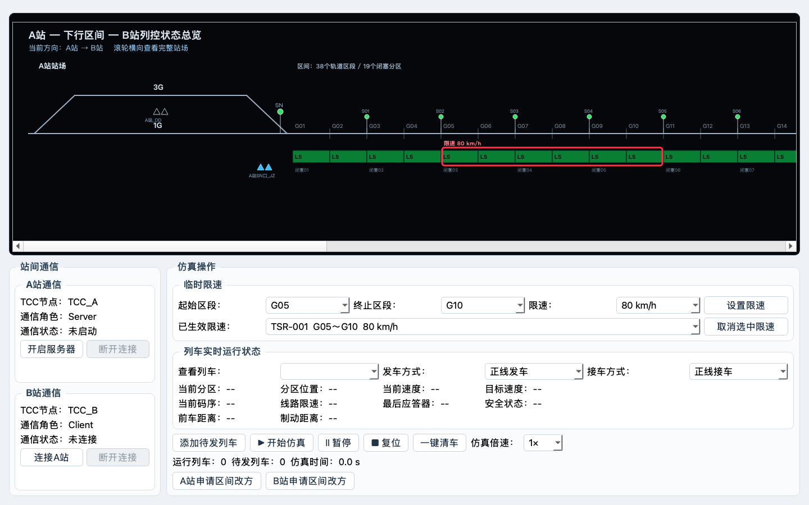

# 阶段 1 修订技术说明

## 修订原因

第一次实现错误地把 A站、区间和 B站分成三幅图，并把区间简化为 8 个分区。用户最终确认 Word 7.1 对应 38 个轨道区段，每两个轨道区段组成一个闭塞分区，共 19 个闭塞分区；站场和区间必须合成一条可横向滚动的长图。

## 连续长图

`TccOverviewWidget` 当前按以下顺序绘制：

```text
A站 1G/3G及咽喉
→ A站 SN 和有源应答器
→ G01～G38
→ BS01(G01/G02)～BS19(G37/G38)
→ 区间有源应答器
→ B站 X 和有源应答器
→ B站 1G/3G及咽喉
```

轨道区段宽度为 66 px，站场宽度为 470 px。线路画布宽于视口，通过普通鼠标滚轮直接驱动水平滚动条；站场咽喉紧靠区间端部，避免设备过度分散。

## 通信修订

- A站：`ServerNetworkWorker`，先开启服务器；
- B站：`ClientNetworkWorker`，随后连接 A站；
- 两站均有独立的断开按钮；
- 断开后恢复启动/连接按钮，原方向状态不因断线自动改变。

## 临时限速

操作区顶部设置专用临时限速区域：起始区段、终止区段、限速值、设置按钮、已生效限速和取消按钮。

`TemporarySpeedService` 负责：

- 校验 G01～G38 的连续范围；
- 生成 TSR 编号；
- 同一区段存在多条命令时取最低速度；
- 取消指定命令；
- 向列车当前区段提供临时限速，并参与目标速度最小值计算；
- 在长图码带外绘制红色限速范围框。

## 交互修订

- 删除操作区内的应答器查看按钮；只允许点击长图中的有源应答器查看信息。
- 未建立通信时，应答器弹窗显示 `ETCS-254`；完整信息包选择在阶段 6 继续完成。
- 复位按钮后增加“一键清车”。清车会暂停仿真、清除运行及待发列车、释放区段占用并关闭信号，但不重置通信、方向、仿真时间和临时限速。
- 查看列车同一行增加正线/侧线发车方式和正线/侧线接车方式。

## 验证

- 区间数量：38 个轨道区段、19 个闭塞分区；
- 临时限速：范围设置、重叠取低、取消、非法范围拒绝；
- 页面合同：A Server、B Client、断开按钮、滚动画布、接发车选择、一键清车；
- 视觉检查：1440×900、1180×760、长图左端和右端；
- 自动测试：11 项通过。


