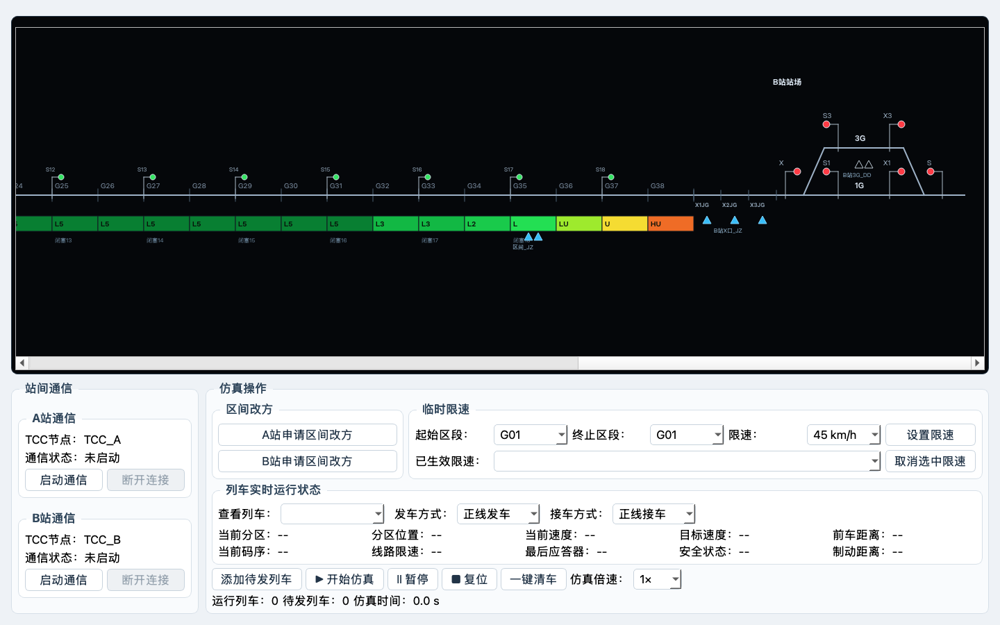

# 阶段 1 修订技术说明

## 修订原因

第一次实现错误地把 A站、区间和 B站分成三幅图，并把区间简化为 8 个分区。用户最终确认 Word 7.1 对应 38 个轨道区段，每两个轨道区段组成一个闭塞分区，共 19 个闭塞分区；站场和区间必须合成一条可横向滚动的长图。

## 连续长图

`TccOverviewWidget` 当前按以下顺序绘制：

```text
A站 1G/3G及咽喉
→ A站 SN 和有源应答器
→ G01～G38
→ BS01(G01/G02)～BS19(G37/G38)
→ 区间有源应答器
→ B站 X 和有源应答器
→ B站 1G/3G及咽喉
```

轨道区段宽度为 66 px，站场宽度为 470 px。线路画布宽于视口，通过普通鼠标滚轮直接驱动水平滚动条；站场咽喉紧靠区间端部，避免设备过度分散。

## 通信修订

- 删除通信角色整行，A/B 两站界面不显示 Server 或 Client；
- 两站按钮统一为“启动通信”：先启动者内部创建 `ServerNetworkWorker` 监听 9000，后启动者创建 `ClientNetworkWorker` 自动连接；
- 两站均有断开按钮；任一方断开会停止双方线程、清除本轮角色并恢复两个“启动通信”按钮；
- 下一轮重新按点击顺序选举，原区间方向不因断线自动改变。

## 站场精细化

- A、B站均按 Word 7.1 绘制 1G、3G、左右咽喉和 6 架信号机。
- 信号机用偏置灯头表达固定物理方向：X、X1、X3 朝右，S、SN、S1、S3 朝左；改方不翻转图形。
- A站在 SN 后增加 `X1LQ、X2LQ、X3LQ`，B站在 X 前增加 `X1JG、X2JG、X3JG`。
- A站 SN 外方和 B站 X 外方各绘制 3 枚可点击的实心有源应答器；两站 3G 内各绘制 2 枚空心无源应答器。
- 单站画布宽度由 470 px 收紧至 390 px，在增加设备细节的同时缩短无效空白。

## 临时限速

操作区顶部设置专用临时限速区域：起始区段、终止区段、限速值、设置按钮、已生效限速和取消按钮。

`TemporarySpeedService` 负责：

- 校验 G01～G38 的连续范围；
- 生成 TSR 编号；
- 同一区段存在多条命令时取最低速度；
- 取消指定命令；
- 向列车当前区段提供临时限速，并参与目标速度最小值计算；
- 在长图码带外绘制红色限速范围框。

## 交互修订

- 删除操作区内的应答器查看按钮；只允许点击长图中的有源应答器查看信息。
- 未建立通信时，应答器弹窗显示 `ETCS-254`；完整信息包选择在阶段 6 继续完成。
- 复位按钮后增加“一键清车”。清车会暂停仿真、清除运行及待发列车、释放区段占用并关闭信号，但不重置通信、方向、仿真时间和临时限速。
- 查看列车同一行增加正线/侧线发车方式和正线/侧线接车方式。

## 布局二次优化

- 操作区首行由“区间改方”和“临时限速”两个独立分组组成，前者在左、后者在右，宽度比例为 1:3。
- 列车实时状态改为两行五列：前车距离并入第一行，制动距离并入第二行，删除多余第三行。
- 查看列车、发车方式和接车方式使用紧凑水平排列，标签紧贴对应下拉栏，剩余空间统一留在行末。
- 下方通信与操作容器按内容确定高度；主页面上下伸缩比调整为 9:3，使黑底 2D 区域更高。
- 通信卡片删除底部弹性留白；操作区内边距和组间距统一收紧，但保留清晰的分组边界。

## 验证

- 区间数量：38 个轨道区段、19 个闭塞分区；
- 临时限速：范围设置、重叠取低、取消、非法范围拒绝；
- 页面合同：无通信角色栏、动态先 Server 后 Client、双端共同复位、滚动画布、接发车选择、一键清车；
- 视觉检查：1440×900 时 2D 区约 510 px 高，1180×760 时约 370 px 高；两种尺寸均无控件裁切；
- 自动测试：16 项通过；除站场合同外，覆盖两种启动顺序的动态角色选举、双端共同复位和主动关闭错误抑制。
- 真实链路检查：B先启动、A后启动时内部选举为 B Server/A Client，两侧 UI 均只显示“已连接”；任一方断开后双方恢复“未启动”。



