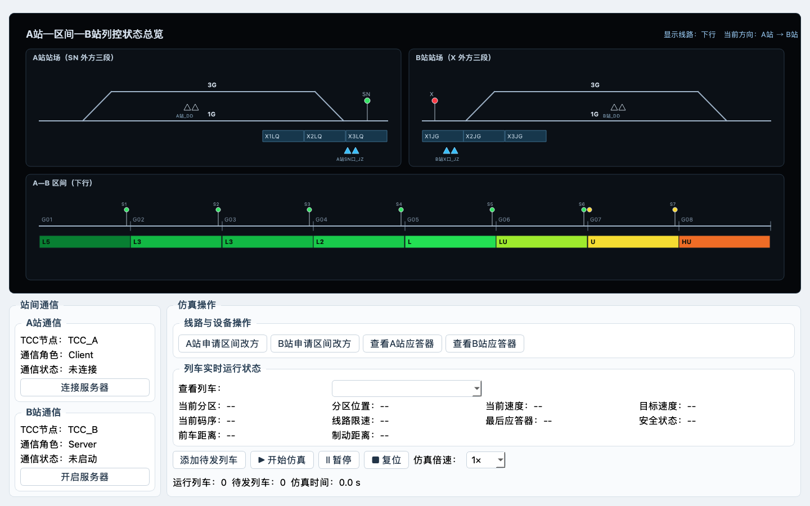

# 阶段 1 技术说明：UI 骨架与 7.1 静态总图

## 目标与依据

本阶段只实现表现层骨架，不改动既有业务算法。布局依据参考图片 2；线路要素依据 Word 7.1；画面语言参考图片 1并改为黑色背景。

## 页面结构

- 上方：`visualization_area`，占主要空间，内部为 `TccOverviewWidget`。
- 左下：`communication_area`，A/B 通信卡片垂直排列，只保留节点、角色、状态和连接按钮。
- 右下：`operation_area`，分为线路与设备操作、列车实时状态、仿真控制三组。
- 窗口默认 1440×900，最小 1180×760，上下伸缩比为 7:4。

## 2D 绘图

`TccOverviewWidget` 使用 QPainter 和比例坐标绘制，不依赖背景截图：

- 画布背景为 `#05070a`；
- 上半部并列绘制 A 站和 B 站；
- 两站均含 1G、3G、两端咽喉、进/出站口信号和应答器；
- A 站 SN 外方绘制 X1LQ～X3LQ；
- B 站 X 前方绘制 X1JG～X3JG；
- 下半部绘制 G01～G08、区间信号机和轨道电路码带；
- 有源应答器用高亮实心三角形组，无源应答器用浅色空心三角形组；
- 保留原 `set_state()` 接口，使既有轨道、列车、方向和信号状态可以继续刷新画面。

## 界面合同

`layout_contract()` 固定了本阶段不可丢失的结构：A/B 两站、两端各 3 个外方区段、8 个区间分区、下行显示及至少两个有源应答器组。后续配置化迁移必须继续满足此合同。

## 测试

运行：

```text
.venv/bin/python -m unittest discover -s tests -v
```

当前结果：3 项通过，分别验证 7.1 结构、黑色背景、三块式主界面及取消项不出现在界面。

## 人工检查

已在 1440×900 和 1180×760 下生成界面截图。第一次检查发现顶部标题重叠和 B 站通信卡片裁切；已删除重复标题，并把改方/应答器按钮移动到右侧操作区。最小窗口的首次检查又发现码带和统计文字裁切，随后改为按可用高度缩放并把统计信息独立成行。最终截图中三块区域边界清楚，A/B 通信卡片、码带和操作按钮均无裁切。



## 本阶段不处理

- 站场设备配置化；
- 四类进路；
- Word 最终编码及灯色算法；
- 应答器信息包弹窗；
- 临时限速；
- 四步改方状态机。

这些内容分别由阶段 2～8 完成，不能把当前兼容状态当作最终规则。
