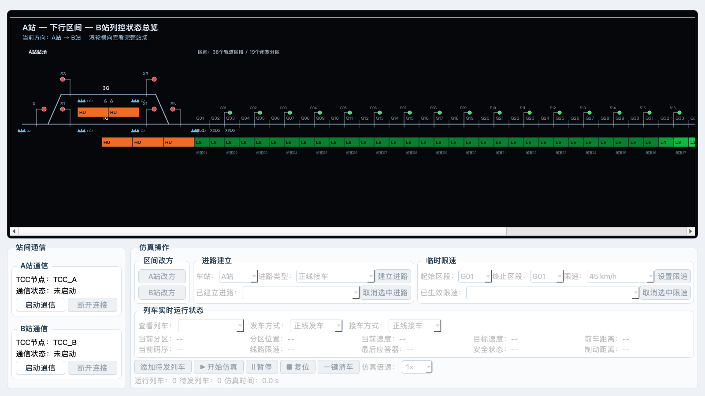
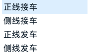

# 阶段 3 技术说明：进路建立、取消与联动

## 目标与范围

本阶段依据 Word 文档中的接发车、编码、点灯、应答器和改方约束，实现 A/B 两站的四类进路，并把进路状态接入列车、信号、区间边界编码、有源应答器和区间改方。日志模块仍不在当前范围内。

## 领域模型与唯一状态源

`RouteService` 是进路状态的唯一写入点。界面、绘图、列车、信号和改方模块只通过服务接口读写，不各自保存第二份业务状态。

| 进路类型 | 显示名称 | 股道 | 用途 |
|---|---|---|---|
| `MAIN_RECEIVE` | 正线接车 | 1G | 接车 |
| `SIDE_RECEIVE` | 侧线接车 | 3G | 接车 |
| `MAIN_DEPART` | 正线发车 | 1G | 发车 |
| `SIDE_DEPART` | 侧线发车 | 3G | 发车 |

每条进路保存车站、类型、股道、接发属性、状态、绑定列车和建立顺序。状态为 `ESTABLISHED` 或 `LOCKED`。同一车站同时只允许一条活动进路；A、B 两站不得同时建立对向发车进路；一端发车和对端接车可以并存。

## 建立、取消和锁闭生命周期

1. 用户在“进路建立”区域选择车站和四类进路之一。
2. 服务校验同站冲突和对向发车冲突后建立进路。
3. 列车只有取得当前方向发车站、对应 1G/3G 的发车进路才能进入区间。
4. 列车进入入口区段时进路锁闭并绑定列车；锁闭后人工取消按钮禁用，服务层也拒绝直接取消。
5. 列车由入口区段进入第二区段后，发车进路自动释放。
6. 列车进入运行方向末区段时，匹配的目的站接车进路锁闭；列车到站后自动释放。
7. “一键清车”只清除列车，保留已建立进路；“复位”清除列车、仿真时间和区段占用，保留进路与临时限速，并将锁闭进路恢复为“已建立、未锁闭”。

列车保存独立的发车方式和接车方式：正线映射 1G，侧线映射 3G。默认接车方式与发车方式一致，界面可以分别选择。

## 信号、编码和应答器联动

- 发车信号开放必须同时满足：方向允许、入口区段空闲、存在匹配发车进路。
- 正线发车按入口前方码序映射灯色；侧线 18 号及以上场景按 Word 示例显示 `L灯`。
- 目的端存在接车进路时，区间末端编码把停车目标向站内延伸一个单元；无接车进路时末端保持 `HU`。
- 未通信时，有源应答器固定返回 `ETCS-254`。
- 通信建立后，无有效进路返回关闭信号默认包；正/侧线接发车按进路类型加入 `ETCS-27`、`ETCS-68`、`CTCS-1` 等组合。
- 只有存在实际生效的临时限速时才追加 `ETCS-44(CTCS-2)`。

## 区间改方联动

申请方必须已有本站发车进路；被申请站存在发车进路时拒绝改方。原有全区间空闲、无列车和信号关闭条件继续生效。拒绝只更新改方状态和原因，不删除已建立进路；合法申请完成后两端方向一致。

## UI 与 2D 表现

操作区顶部依次为“区间改方”“进路建立”“临时限速”，最终伸缩比例为 `1:4:5`。进路和限速区域均采用图示两行布局：进路第一行依次为“车站、进路类型、建立进路”，第二行为“已建立进路、取消选中进路”；限速第一行依次为“起始区段、终止区段、限速、设置限速”，第二行为“已生效限速、取消选中限速”。活动进路文字格式为 `A站｜正线发车｜1G｜已建立`，锁闭后显示“已锁闭”；没有活动进路时选择框保持空白。每行改用零水平间距网格，标签和按钮位置固定，选择框列吸收剩余空间，因此左边紧接冒号、右边延伸到下一标签或操作按钮。所有控件继承全局字体；下拉弹层通过专用绘制代理将悬停/选中项稳定绘制为浅蓝背景和深色文字，推荐窗口和 1600×760 安全最小窗口下均不遮挡。

程序初始只有 A、B 两站“启动通信”按钮可用。必须收到两站实际连接事件后才解锁改方、进路、限速和列车操作；断开任一站会暂停仿真并重新锁定操作区，但保留列车、进路和临时限速。当前方向 A→B 时只允许 A 站发车进路与 B 站接车进路，B→A 时规则镜像。开始仿真前会整批校验每辆待发列车的发车方式和接车方式，任一列车缺少匹配进路即拒绝启动。

重复进路、同站冲突、方向错误、临时限速重叠、空队列启动、接发方式不匹配和改方拒绝均使用“操作失败、当前状态、处理建议”三段式弹窗。活动临时限速按闭区间检测，任何共享区段都会拒绝新限速；仅首尾相邻而不共享区段的两个限速允许同时存在。

后续修订将 `X1LQ～X3LQ`、`X1JG～X3JG` 纳入既有 38 个物理区段：分别作为 G01～G03、G36～G38 的第二行设备名，全部区段统一为 34 px 显示宽度。A/B 站的 1G、3G 和区间侧咽喉增加低频码带，主线码带与区间码带同高且无缝衔接；每站按固定设备位置绘制 JZ、FJZ、X1/X3 对应 CZ、S1/S3 对应 FCZ，每组均为 3 枚紧凑有源应答器，放在钢轨与码带之间并保留独立点击区域。

2D 连续长图用浅青色 4 px 线条高亮进路：正线贴合 1G，侧线贴合 3G 和区间侧咽喉。A/B 站位置镜像，信号机物理方向不随运行方向或接发属性翻转；信号、应答器和文字最后绘制，避免被高亮遮挡。

## 验证结果

- 自动测试：本阶段初验 47 项全部通过；布局、站内编码、完整 L4 码序、应答器位置、通信门禁、操作校验、自适应控件及最终状态恢复修订后扩展为 82 项。
- 语法检查：进路、列车、信号、改方和 UI 关键模块全部通过 `py_compile`。
- 业务脚本：A 正线发车、A 侧线发车、B 正线接车、B 侧线接车、未进入取消、进入后拒绝取消、驶过释放、无进路禁发、冲突改方拒绝和合法改方成功全部通过。
- 视觉检查：1600×900 与 1600×760 均无控件裁切或重叠；活动进路可读；选择框紧接标签并充分扩展；下拉列表悬停项为浅蓝背景、深色文字；站场高亮不遮挡设备。
- 最终自审：补充停车列车仍占用区段、非法改方目标拒绝、锁闭进路不可被其他列车重绑、暂停后空待发队列可继续运行、一键清车解除悬空进路锁闭五项回归测试。

## 后续边界

本阶段完成的是课程仿真所需的进路状态和跨模块联动。道岔逐组定位/反位模型、完整站内轨道占用、Word 全部场景的码序表驱动和 7.6 特殊演示模式仍按总方案后续阶段实施，不在本阶段伪造。
