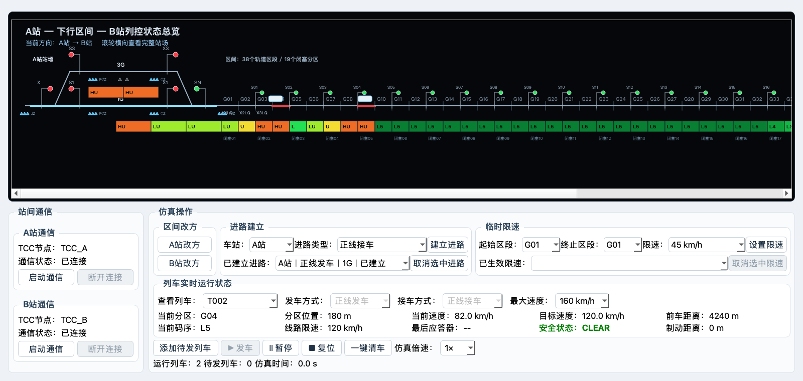

# 阶段 5 增量技术说明：多列车选择发车与实时限速

## 目标与范围

本次增量把原来的单一列车启动流程扩展为多列车并行仿真。界面中的“发车”只作用于“查看列车”当前选中的一辆待发列车；已经发车的其他列车继续由同一个仿真时钟推进。暂停、继续和复位是全局操作，进路和临时限速仍由各自服务独立维护。

本次不改变 38 个区间轨道区段、19 个闭塞分区、站场物理设备位置、进路类型或临时限速范围规则，也不新增日志功能。Word 7.6 特殊演示模式仍属于后续工作。

## 列车配置与状态

每辆列车独立保存：

- 发车方式与接车方式；
- 当前区段、区段内位置、当前速度和目标速度；
- 最大速度、线路限速、轨道码限速、临时限速和应答器限速；
- 前车距离、制动距离、安全状态和最后读取的应答器。

添加列车时只创建待发对象，不写入界面当前接发方式。点击“发车”时才读取当前选中列车、正/侧线接发方式和最大速度，并在全部校验通过后一次性写入。允许的最大速度固定为 `80、120、160、200、250、300、350 km/h`，默认 `120 km/h`。

待发列车的发车、接车方式和最大速度可以编辑；列车发出后，接发方式锁定，最大速度在运行或暂停状态仍可修改。运行中降低最大速度只降低目标速度，当前速度按既有制动模型逐步下降，不发生速度跳变。

## 发车与多车追踪

发车按明确列车编号执行，不再保存或自动选择单一的延迟发车目标。发车前依次校验：

1. 当前选中列车存在、状态为待发且仍在待发队列；
2. 当前方向下的发车站和到达站均已建立与所选正/侧线一致的进路；
3. 两端进路没有被其他列车锁闭；
4. 区间入口没有被占用；
5. 同方向前车已经越过第三个轨道区段，入口后至少保留两个完整区段；
6. 最大速度属于固定允许值。

任何条件失败都会显示“操作失败、当前状态、处理建议”三段式弹窗，并保持列车、队列、进路锁闭和区段占用不变。仿真运行期间可以继续选中另一辆待发列车并点击“发车”；只有满足全部安全条件的选中列车会进入运行状态。

每个时钟周期先建立所有运行列车的位置快照，再按运行方向从前到后推进，防止同一周期内后车读取到不完整状态。跨区段时禁止后车与前车进入同一区段或超越前车。B→A 使用完整 38 区段反向顺序计算绝对位置，与 A→B 使用同一套间隔逻辑。

## 编码、信号与占用

全部运行或暂停列车共同组成轨道占用集合。每次位置变化后统一执行：

1. 清理旧占用并按所有列车当前位置重新占用；
2. 对每个占用点分别生成后方防护码序；
3. 多个防护源影响同一区段时选择允许速度更低的码；
4. 根据入口空闲、前车间隔、方向和进路重新计算信号；
5. 将轨道码、临时限速和前车距离反馈到每辆列车的目标速度。

因此，多辆车同时运行时，后车能够随前车位置变化得到更严格的轨道码和信号防护，不依赖绘图坐标推断业务状态。

## 全局控制语义

- “暂停/继续”同时控制所有运行或暂停列车；全局暂停期间即使误触更新周期，列车也不会移动。
- “复位”把全部运行、暂停和已到达列车送回各自出发点并重新加入待发队列；保留列车接发配置、最大速度、人工建立的进路和临时限速，只解除列车造成的锁闭和占用。
- “一键清车”清除全部待发、运行、暂停和已到达列车，解除列车造成的占用与进路锁闭，但不删除人工建立的进路或临时限速。
- “查看列车”切换后，状态栏、接发方式和最大速度同步展示所选列车，不影响其他列车运行。

## UI 验收

“开始仿真”已改为“发车”。“最大速度”位于“接车方式”右侧，固定七档。操作区顶部仍保持“区间改方、进路建立、临时限速” `1:4:5` 比例；新增控件没有改变既有两行布局。

1600×760 验收截图中同时显示 T001、T002 两辆运行列车，当前选择 T002；接发方式为锁定状态，最大速度 `160 km/h` 可见且可编辑，按钮、标签和下拉框无裁切或覆盖。

## 验证结果

- 多车专项测试：15 项全部通过，覆盖选择发车、原子失败、间隔拒绝、全局暂停/继续/复位、多车同步推进、不可超越、实时最大速度及多占用编码。
- 全量回归：102 项全部通过。
- 语法检查：`models`、`services`、`ui`、`tests` 全部通过 `compileall`。
- 差异检查：`git diff --check` 无输出。
- 视觉检查：1600×760 截图中两辆车占用、当前列车信息、接发方式锁定、最大速度和 `1:4:5` 操作区均显示正常。

## 中断后恢复入口

如后续继续扩展，先阅读根目录 `PROGRESS.md` 和本文件，运行全量测试确认仍为 102 项通过，再从总方案中的未完成阶段继续。不得恢复已经删除的自动目标列车逻辑，也不得把发车按钮改回批量发车。
